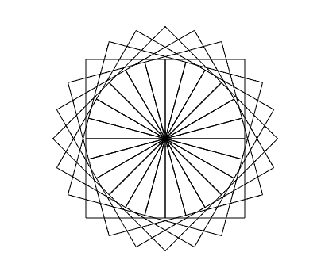

## Exercise 1

Program the bird to reach the pig:

https://studio.code.org/hoc/5

## Exercise 2

Reach the pig using the "repeat" command

https://studio.code.org/hoc/8

Finished already? Try some of the other mazes while you wait, for example https://studio.code.org/hoc/10

## Exercise 3

Open the "Turtle Roy" page: https://turtle-roy.herokuapp.com/

Some useful commands:

```
clear - clear the screen
fd 100 - move forward 100 pixels
rt 90 - rotate 90 degrees
```

Now write a program to draw a square!

## Exercise 4

You can repeat a sequence of commands with the `r` and `s` commands. For example:

```
s [fd 100, lt 90]
r 2 (s [fd 100, lt 90])
```

Now draw the square again using the "repeat" command. It should take only one line of code. Remember to `clear` first.

## Exercise 5

You can teach Turtle Roy the word "askel" with the `let` command:

```
let askel = s [fd 100, lt 90]
```

Now teach Turtle Roy the word "neliö", which draws a square using the "askel" command

## Exercise 6

How would you draw the picture below using what you learned so far?



Bored? Check more exercises here! https://github.com/koodikoulu/koodikoulu/blob/master/1_turtle_roy.md